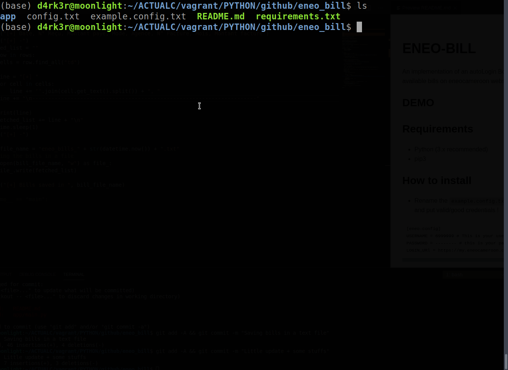

# ENEO-BILL

An implementation of an autoLogin Bot that will fetch available bills on eneocameroon website !

## DEMO



## Requirements

- Python (3.x recommended)
- pip3

## How to install

- Rename the `example.config.txt` to `config.txt` and put valid/good credentials !
```
[eneo-config]
USERNAME = 6999999 # This is your username on the website
PASSWORD = -------- # this is your password on the webSite
LOGIN_URl = https://my.eneocameroon.cm/login
```

- Hit this command to install all :
```shell
pip3 install -r requirements.txt
```

## How to launch

```shell
python3 -m app.main
```

## Author

- Sanix-darker